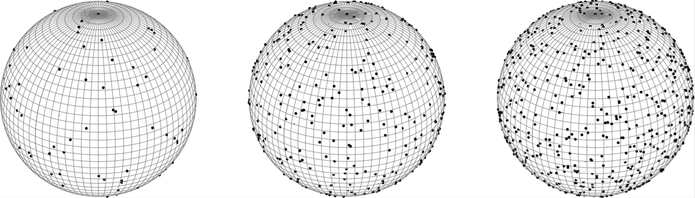

# Compressed Sampling on the Sphere   and the Rotation group 

This repository contains the programs for replicating the results of the following paper:

[Sensing Matrix Design and Sparse Recovery on the Sphere and the Rotation Group](https://arxiv.org/abs/1904.11596)

It also contains the sampling points obtained by Algorithm 1 in the above paper.

## Citation:
 ```
 @article{bangun2019sensing,
  title={Sensing Matrix Design and Sparse Recovery on the Sphere and the Rotation Group},
  author={Bangun, Arya and Behboodi, Arash and Mathar, Rudolf},
  journal={arXiv preprint arXiv:1904.11596},
  year={2019}
}
 
 ```
 
## Dependencies:
* MATLAB ``` patternsearch, multistart```


## Existing sampling points:

To plot the coherence of spherical harmonics and Wigner D-functions matrices from existing sampling points use ``` Plot_Coherence_SH.m, Plot_Coherence_Wigner.m``` for sampling on the sphere and the rotation group, respectively. It should be noted that, the existing points in ``` .mat ``` file should be chosen first.
For example, the following figures are generated when using ```load SH_N100.mat``` for spherical harmonics and  ```load Wigner_N84.mat``` for Wigner D-functions.


To see the distribution of sampling points, run ```samplingdistributions.m``` and load the existing sampling points  ```load  _nameexistingpoints_.mat```. The existing points have been generated until ```B = 100```, which equivalent to the column matrix spherical harmonics ```N = B^2 = 10000```.
For example, the following figures are generaten when using  ```load  SH_N1024.mat```.
 

## Search Algorithm:

To run search algorithm, one should run ``` main.m``` by choosing parameter spherical harmonics bandwidth ```B```, the number of iterations ```MC```, and total samples ```m```.


## Question?

Please drop me an email.
